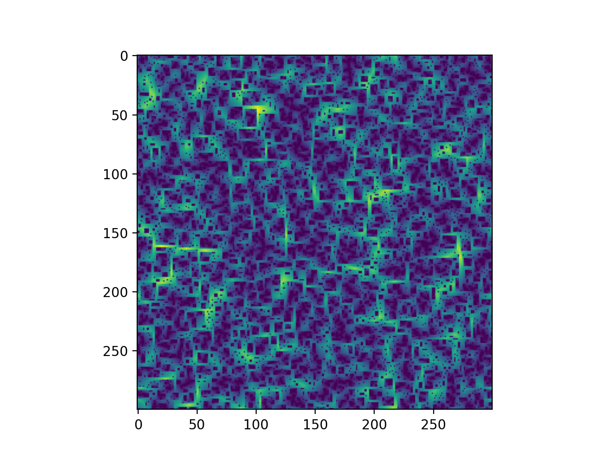
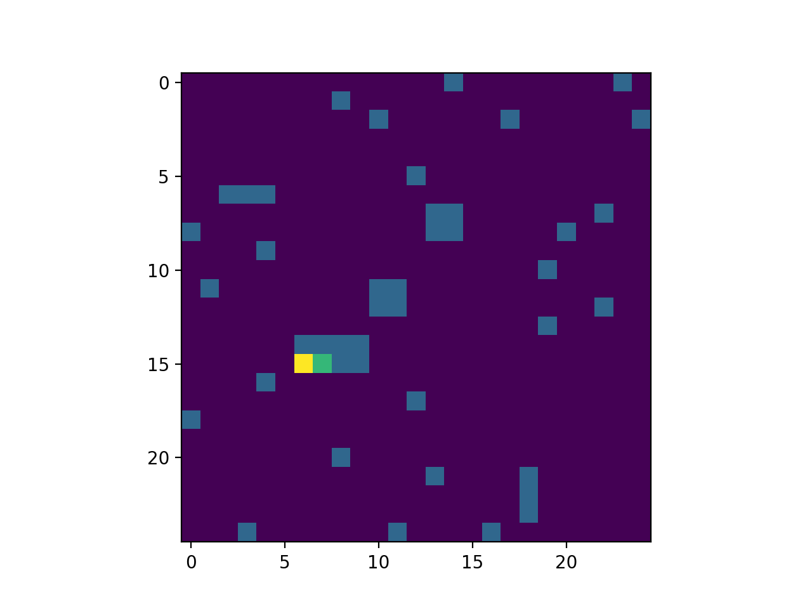

# Bootstrap Percolation Simulation
A simulation of the Bootstrap Percolation automaton, as is described [here](https://mathworld.wolfram.com/BootstrapPercolation.html).

Inspired by: http://www.math.ubc.ca/~holroyd/boot




## Prerequisites

To run the simulator you will need to have Matplotlib installed.

```sh
python3 -m pip install matplotlib
```
